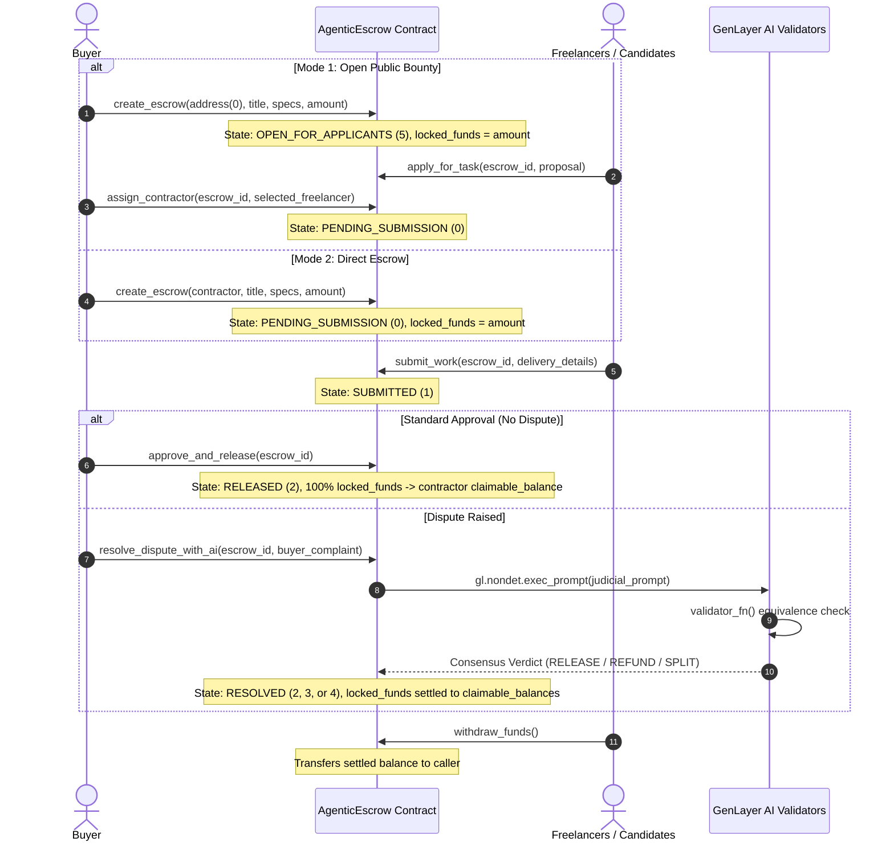

# AgenticEscrow

> **Autonomous AI-Powered Judicial Dispute Resolution and Trustless Escrow Protocol on GenLayer**

[](https://agenticescrow.vercel.app)
[](https://explorer-bradbury.genlayer.com/address/0x6E8f51b3d01791Bc2CbfEa8E0D24281C4A4E0152)
[-8b5cf6?style=for-the-badge)](https://genlayer.com)
[](https://opensource.org/licenses/MIT)

---

## About

**AgenticEscrow** is a next-generation decentralized escrow protocol powered by GenLayer's non-deterministic Intelligent Contracts. It combines decentralized smart contract security with autonomous AI multi-validator arbitration to eliminate human intermediaries, unfair dispute resolutions, and excessive platform commissions in digital commerce, software contracting, and freelancing.

- 🌐 **Live Website / DApp**: [https://agenticescrow.vercel.app](https://agenticescrow.vercel.app)
- 📜 **Deployed Intelligent Contract**: [`0x6E8f51b3d01791Bc2CbfEa8E0D24281C4A4E0152`](https://explorer-bradbury.genlayer.com/address/0x6E8f51b3d01791Bc2CbfEa8E0D24281C4A4E0152)
- ⛓️ **Network**: GenLayer Bradbury Testnet (Chain ID: `4221` / `0x107d`)
- 🔍 **Block Explorer**: [https://explorer-bradbury.genlayer.com](https://explorer-bradbury.genlayer.com)

---

## Table of Contents
- [About](#about)
- [Problem and Motivation](#problem-and-motivation)
- [How AgenticEscrow Solves It](#how-agenticescrow-solves-it)
- [Key Features](#key-features)
- [System Architecture and Workflow](#system-architecture-and-workflow)
- [Intelligent Contract Specification](#intelligent-contract-specification)
- [Live Deployments and Network Details](#live-deployments-and-network-details)
- [Tech Stack](#tech-stack)
- [Local Development Guide](#local-development-guide)
- [License](#license)

---

## Problem and Motivation

In traditional commerce and freelance platforms (such as Upwork, Fiverr, and traditional escrow services), counterparties face three major bottlenecks:
01. **Steep Intermediary Fees**: Centralized intermediaries take between **5% to 20%** commission on transactions.
02. **Single Point of Failure and Human Bias**: Arbitrators are human, prone to fatigue, regional bias, or opaque decision-making processes.
03. **Smart Contract Inflexibility**: Standard Ethereum/EVM smart contracts cannot assess qualitative deliverables (for example: quality of software, test coverage, or compliance with specifications). Without AI consensus, smart contracts either require trusted third-party human oracles or freeze in multi-sig deadlocks.

---

## How AgenticEscrow Solves It

**AgenticEscrow** is a decentralized application built natively on **GenLayer**. By leveraging GenLayer's non-deterministic AI consensus and Intelligent Contracts (`gl.nondet.exec_prompt` combined with strict `validator_fn` equivalence checks):

- **Contract-Controlled Custody & Settlement**: The contract directly custodies locked funds upon creation (`escrow_locked_funds`) and settles funds upon manual buyer approval or AI judicial verdict (100% Release, 100% Refund, or 50/50 Split) into `claimable_balances`, with beneficiary withdrawal via `withdraw_funds()`.
- **Decentralized AI Judiciary**: Independent GenLayer validators run Large Language Models to evaluate contractual agreements against submitted deliverables and dispute claims.
- **Equivalence-Checked Consensus**: Multiple validators independently analyze the evidence and reach consensus on a verdict (RELEASE, REFUND, or SPLIT) with confidence metrics.
- **Autonomous On-Chain Execution**: Once consensus is achieved, funds and state transitions are executed automatically on-chain with zero human intermediaries.

---

## Key Features

- **Dual Escrow Modes**:
  - **Open Public Bounty**: Buyers post specifications with locked GEN rewards without needing a freelancer address upfront. Candidates apply with proposals and resumes. The buyer reviews and assigns the best candidate.
  - **Direct Private Escrow**: Buyers specify a designated contractor address upfront for bilateral agreements.
- **Direct Web3 Deposit & Contract Custody**: Buyers approve a MetaMask transaction directly locking native GEN funds under Intelligent Contract custody (`escrow_locked_funds`).
- **Real-Time On-Chain Transaction Tracking**: Visual progress bars directly inside each task card reporting validator status (`COMMITTING`, `REVEALING`, `ACCEPTED`) with live block explorer links.
- **Contract-Controlled Financial Custody & Settlement**: Complete on-chain fund lifecycle management (`escrow_locked_funds`, `claimable_balances`, `withdraw_funds`, `reopen_task`).
- **Instant Native GEN Payout**: Settled escrows automatically deliver native GEN payouts directly to the contractor wallet upon approval or judicial verdict.
- **Role-Based Status Badging**: Displays `Delivered` for the designated freelancer and `Completed` for the client and public observers.
- **End-to-End Escrow Lifecycle**: Create agreements, lock native GEN funds, review applicants, assign contractors, submit deliverables, release payment, or trigger arbitration.
- **Natural Language Contract Specifications**: Parties can define deliverables in plain English or code specifications.
- **Automated Evidence Assessment**: Evaluates URLs, commit hashes, documents, and technical requirements.
- **Three-Way Judicial Verdicts & Settlement**:
  - `RELEASE`: Contractor successfully delivered according to specifications (100% custody settled to contractor).
  - `REFUND`: Contractor failed to deliver or submitted fraudulent proof (100% custody refunded to buyer).
  - `SPLIT`: Partial delivery with shared responsibility (50/50 balanced custody split).
- **Consensus Confidence Scoring**: Every judgment records a validator confidence score (0-100%) and a judicial reasoning summary on-chain.

---

## System Architecture and Workflow



---

## Intelligent Contract Specification

The contract is written in Python for the **GenVM v0.3.3** runtime:

### Contract Methods

| Method | Type | Parameters | Description |
| :--- | :--- | :--- | :--- |
| `create_escrow` | `write` | seller: Address, title: str, specifications: str, amount: u256 | Creates a new escrow agreement and locks deposited funds in contract custody. |
| `apply_for_task` | `write` | escrow_id: u64, proposal: str | Freelancers apply for open bounties with proposals and portfolio details. |
| `assign_contractor` | `write` | escrow_id: u64, selected_contractor: Address | Buyer reviews candidate proposals and assigns the chosen contractor. |
| `submit_work` | `write` | escrow_id: u64, delivery_details: str | Assigned contractor submits proof or deliverable links. |
| `approve_and_release` | `write` | escrow_id: u64 | Buyer manually approves; contract settles 100% custody funds to seller claimable balance. |
| `resolve_dispute_with_ai` | `write` | escrow_id: u64, buyer_complaint: str | Triggers multi-validator LLM arbitration and executes contract-controlled settlement (RELEASE 100%, REFUND 100%, or SPLIT 50/50). |
| `reopen_task` | `write` | escrow_id: u64 | Buyer resets a refunded escrow back to open bounty mode, re-locking funds into contract custody. |
| `withdraw_funds` | `write` | None | Beneficiary claims and withdraws their settled claimable balance. |
| `get_claimable_balance` | `view` | user: Address | Returns settled claimable balance for a given wallet address. |
| `get_escrow` | `view` | escrow_id: u64 | Returns full escrow data, locked custody funds, applicants list, verdicts, and confidence scores. |
| `get_total_escrows` | `view` | None | Returns total number of escrows created. |

---

## Live Deployments and Network Details

| Parameter | Value |
| :--- | :--- |
| **Live Web App** | [https://agenticescrow.vercel.app](https://agenticescrow.vercel.app) |
| **Intelligent Contract Address** | [`0x6E8f51b3d01791Bc2CbfEa8E0D24281C4A4E0152`](https://explorer-bradbury.genlayer.com/address/0x6E8f51b3d01791Bc2CbfEa8E0D24281C4A4E0152) |
| **Deployment Transaction** | [`0x3469bb478c2d510a43f2fe5aa0e31c8490db071d29375e62d3651034f6d0b621`](https://explorer-bradbury.genlayer.com/tx/0x3469bb478c2d510a43f2fe5aa0e31c8490db071d29375e62d3651034f6d0b621) |
| **Network Name** | GenLayer Bradbury Testnet |
| **Chain ID** | 4221 (0x107d) |
| **RPC Endpoint** | https://rpc-bradbury.genlayer.com |
| **Explorer** | [https://explorer-bradbury.genlayer.com](https://explorer-bradbury.genlayer.com) |
| **GitHub Repository** | [https://github.com/sinascorpion/genlayer-agentic-escrow](https://github.com/sinascorpion/genlayer-agentic-escrow) |

---

## Tech Stack

- Smart Contracts: Python (genlayer-py, GenVM v0.3.3)
- Frontend Framework: Next.js 16 (App Router), React 19, TypeScript
- Styling: Tailwind CSS and Modern GenLayer Dark Theme
- Icons: Lucide React
- Blockchain Connectivity: viem, genlayer-js
- Hosting and CI/CD: Vercel

---

## Local Development Guide

### Prerequisites
- Node.js 18+ or 20+
- Python 3.10+\n- GenLayer CLI (npm install -g genlayer)

### Step-by-Step Installation

```bash
# 1. Clone the repository
git clone https://github.com/sinascorpion/genlayer-agentic-escrow.git
cd genlayer-agentic-escrow
 
# 2. Enter frontend directory and install dependencies
cd frontend
npm install
 
# 3. Start local development server (Port 2052)
npm run dev -- -p 2052
```

Navigate to http://localhost:2052 in your browser.

---

## License

This project is licensed under the **MIT License** - see the [LICENSE](LICENSE) file for details.
